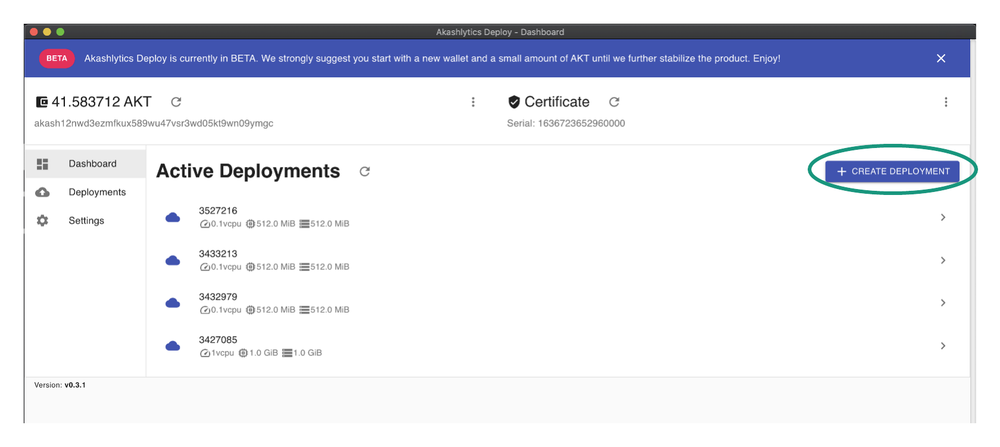
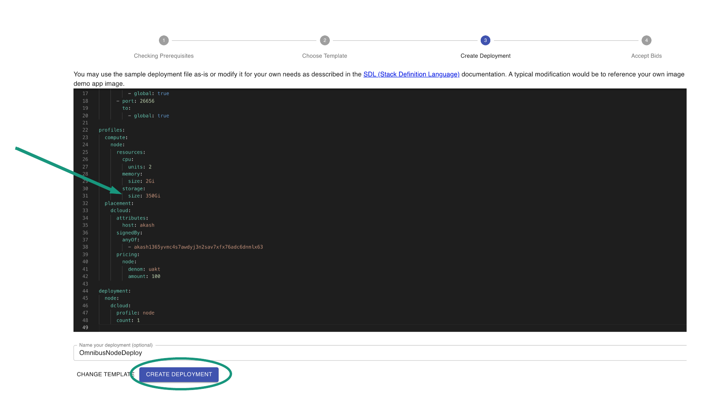
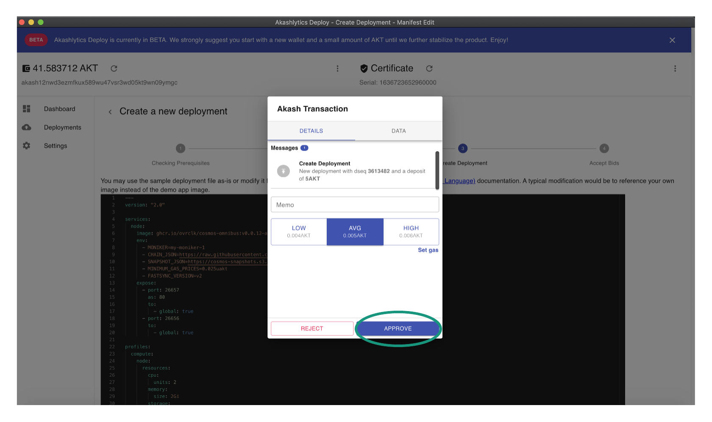
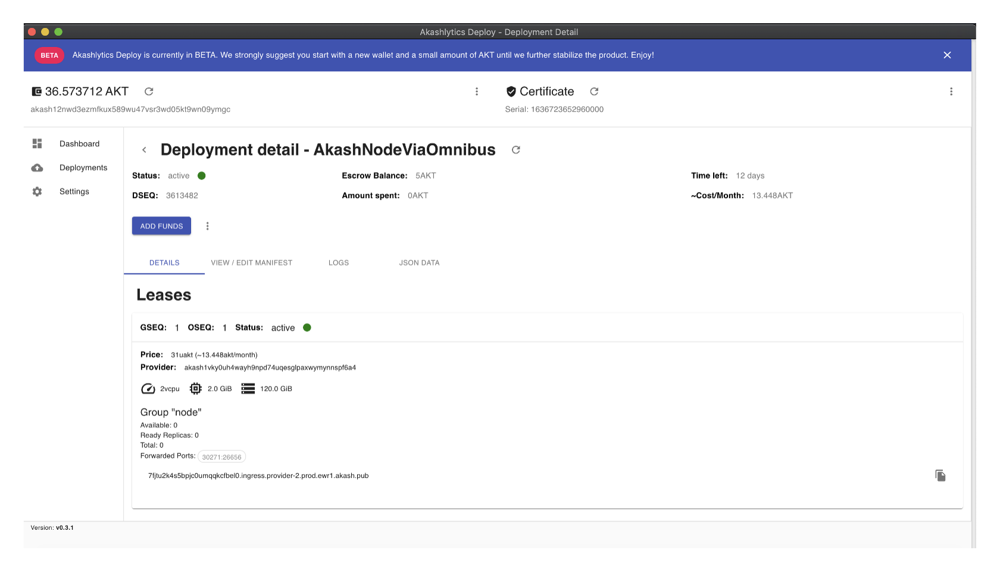
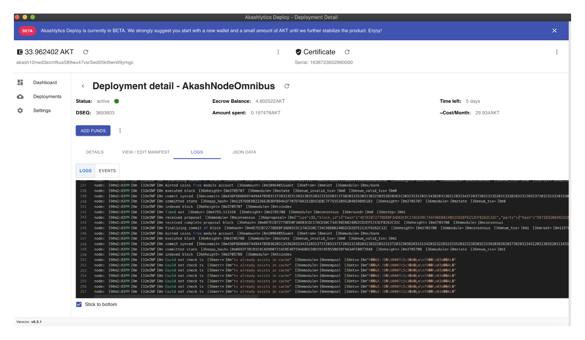
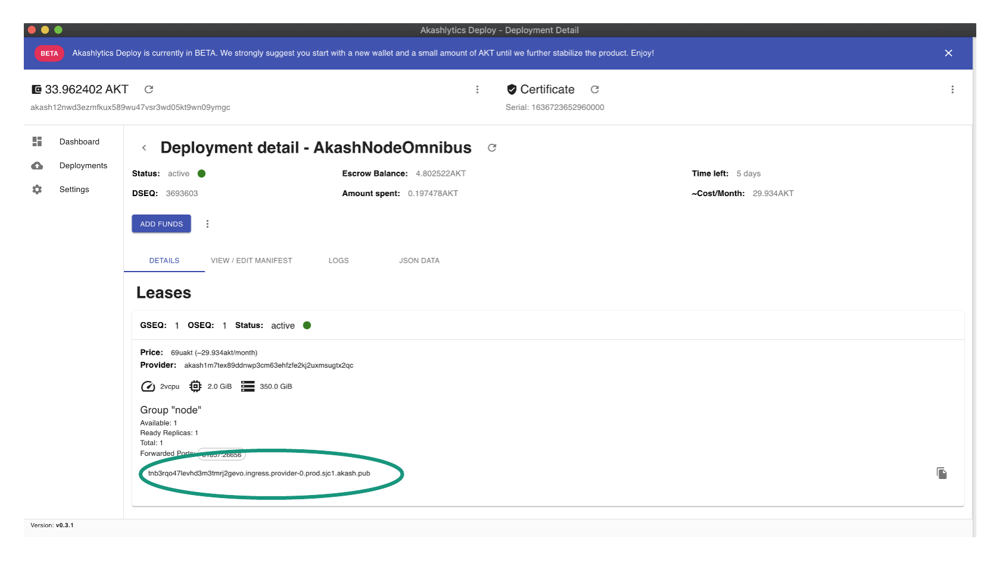
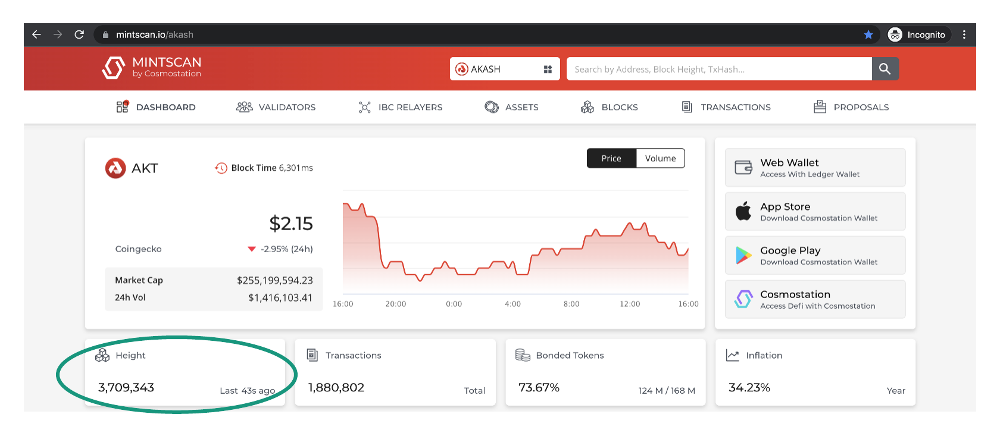

In this guide we will cover the deployment of an Akash Node using Cosmos Omnibus. Omnibus will deploy the node onto Akash’s distributed network. Omnibus will greatly simplify the deployment process.

For fine tuning of the Akash Node check the _Additional Information_ section.

## Cloudmos Deployment of a Node

### Cloudmos Deploy Overview

If you have not used Cloudmos Deploy previously, please use [this guide](/docs/docs/deployments/akash-cli/installation/) to get started. The guide includes steps to install the app and to set up a wallet for Akash deployments. Once the Cloudmos Deploy tool is installed, return to this guide to walk through the Akash Node deployment.

### Cloudmos Deploy Walkthrough

* Our Akash Node install begins by creating a new deployment

* A number of checks are completed to make sure we are ready to deploy a new app onto Akash
* Revisit the Cloudmos Deploy guide for tips if any checks fail

.png>)

* To install the Akash Node we will use a custom SDL file
* Select the “Empty” option so that we can copy/paste the Akash Node SDL in the next step

.png>)

* Copy and paste the SDL from [this site](https://github.com/akash-network/cosmos-omnibus/blob/master/akash/deploy.yml) into the Cloudmos SDL editor window
* **NOTE -** the SDL within GitHub currently has a storage > size value of 120Gi. Omnibus uses a compressed snapshot of the blockchain and when expanded 120GB of storage for the deployment will not be enough. At the time of this writing adjusting the storage size to 350GB will suffice and allow some growth. Please adjust the storage appropriately and as shown in the screenshot below.

* Accept the initial deposit of 5 AKT into the deployment’s escrow account
* The escrow can be refilled easily within Cloudmos Deploy at any time

 (1) (1) (2).png>)

* Approve the transaction fee to allow the deployment to continue

* Select a provider from the bid list

.png>)

* Accept the transaction fee to create a lease with the provider

.png>)

### Cloudmos Deploy Complete

* Once the deployment is complete the lease details are shown

* After some time the Available/Ready Replicas fields will update to show the current node count. It may be necessary to refresh the screen for this count to update.

.png>)

## Confirmation of Node Deployment

With the install of the Akash node complete, it must sync with the blockchain. Omnibus will use a snapshot of prior blocks to speed the sync but even so this will take several hours. In the meantime let’s look into monitoring the sync and the running node’s health.

### Snapshot Download Progress

* While the blockchain snapshot is downloading, the following logs should be visible within Cloudmos
* We can know that the snapshot download is not yet complete if we see this message in the logs

### Snapshot Download Completed

* After the snapshot download completes the logs will begin showing blockchain sync activity
* Example output shown should look something like this but with the current blocks on the chain

### Akash Node Verifications

* These confirmations can be used after the snapshot has been completed

#### Capture Deployment Address

* Begin by capturing the deployment’s public URI from Cloudmos

#### Confirm Blockchain Sync

* Open a web browser and enter the Node’s URI as an address
* If the Node deployed successfully we should view a list of RPC endpoints
* Click the link to visit the Node’s status page

 (1) (1) (2) (2).png>)

* Look for the “latest\_block\_height” field

* Open [Mintscan](https://www.mintscan.io/akash), a popular blockchain explorer, to compare the captured “latest\_block\_height” value to the latest block displayed in the explorer
* The block height from the Akash Node and Mintscan will not be exactly match but should be close to each other

#### Confirm Peer Nodes

* Navigate back to the home page for your Node
* Click the link for “net\_info”

.png>)

* Find the section with the name of “peers”
* Here we can determine what other Akash nodes our node is connected to and the status of these connections

.png>)

## Additional Information

### Cosmos Omnibus Repository

* The repository for the [Akash Cosmos Omnibus ](https://github.com/akash-network/cosmos-omnibus)project.

### Akash SDL

* The Akash manifest/SDL used in this [guide](https://github.com/akash-network/cosmos-omnibus/blob/master/akash/deploy.yml).

### Chain JSON Config File

* The [config file](https://raw.githubusercontent.com/akash-network/net/main/mainnet/meta.json) used for the genesis URL, seed nodes, etc.

### Cosmos Chain Registry

* This [repo](https://github.com/cosmos/chain-registry) contains a chain.json for a number of cosmos-sdk based chains. A chain.json contains data that makes it easy to start running or interacting with a node.