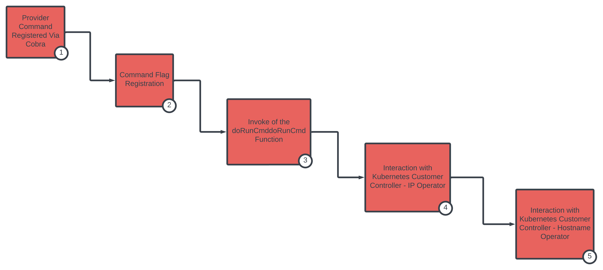

## Visualization

> Use the visualization coupled with the Code Review section for correlated code deep dive




## Code Review


#### 1). Provider Command Registered Via Cobra

The Akash Provider command is registered via Cobra allowing initiation of the provider service via `provider-services run` via the Akash CLI.

> [Source code reference location](https://github.com/akash-network/provider/blob/95458f90c22c3be343efa7402ba4ac72100e251c/cmd/provider-services/cmd/run.go)

```
// RunCmd launches the Akash Provider service
func RunCmd() *cobra.Command {
	cmd := &cobra.Command{
		Use:          "run",
		Short:        "run akash provider",
	}
```

#### 2). Command Flag Registration

Provider services `run` command flags are registered via Cobra.

> Example Cobra command flag registration for the declaration of the provider withdraw period is displayed in code capture.  A similar declaration is made for all related `run` command flags.

```
	cmd.Flags().Duration(FlagWithdrawalPeriod, time.Hour*24, "period at which withdrawals are made from the escrow accounts")
	if err := viper.BindPFlag(FlagWithdrawalPeriod, cmd.Flags().Lookup(FlagWithdrawalPeriod)); err != nil {
		return nil
	}
```

> Within the const declaration within this file `FlagWithdrawalPeriod` is defined.  Via this const value the command and flag resultant allows the CLI entry of `provider-services run --withdrawal-period <value>` during provider service initiation

```
	FlagWithdrawalPeriod                 = "withdrawal-period"
```

#### 3). Invoke of the doRunCmd Function

When the Provider Services `run` command is executed the `RunE` block defines downstream code execution on initiation.  Primarily note the call of the `doRunCmd` function.  This function exists in the same source code file.

> The `doRunCmd` function when called invokes several items core to Akash Provider operation a.  As the primary focus of this section is the Akash Provider service and relational Akash Proviider Operators, we will not deep dive into these critical components but will expand on such functionality in other documentation sections.\
> \
> A listing of core pieces of operation invoked in the `doRunCmd` include:
>
> * Creation of Akash RPC node client for transaction monitoring and broadcasting via a call of the `client.NewClientWithBroadcaster` function
> * Creation of Kubernetes client for K8s cluster CRUD operations via a call of the `createClusterClient` function
> * Creation of Akash Provider Bid Strategy via a call of the `createBidPricingStrategy` function
> * Creation of REST API gateway - utilized for request/response for simple provider GET endpoints such as `/status` and `/version` and POST endpoints such as manifest receipt on lease won event - via call of the `gwrest.NewServer` function located in `provider/gateway/rest` directory.

```
		RunE: func(cmd *cobra.Command, args []string) error {
			return common.RunForeverWithContext(cmd.Context(), func(ctx context.Context) error {
				return doRunCmd(ctx, cmd, args)
			})
		},
```

#### 4). Interaction with Kubernetes Customer Controller - IP Operator

Within a dedicated document in this section the [Akash IP Operator](/docs/eng-notes/akash-provider-operators/akash-operator-overview/ip-operator-for-ip-leases/) - a Kubernetes custom controller implementation - code is covered in detail.  In this document the interaction with the IP Operator from the Akash Provider service is covered.

Cobra command flag declaration includes the following definition which allows the basic enablement of IP Leases when `provider-services run` is executed during Provider creation.

```
###Const declaration which dictates the command flag to be "ip-operator".
###The flag accepts a boolean true/false to determine if IP Leases should be enabled.
	FlagEnableIPOperator                 = "ip-operator"


cmd.Flags().Bool(FlagEnableIPOperator, false, "enable usage of the IP operator to lease IP addresses")
	if err := viper.BindPFlag(FlagEnableIPOperator, cmd.Flags().Lookup(FlagEnableIPOperator)); err != nil {
		return nil
	}
```

If the `enableIPOperator` is `true` an `ipOperatorClient` session is opened to allow Provider service to IP Operator communication.

```
	// This value can be nil, the operator is not mandatory
	var ipOperatorClient operatorclients.IPOperatorClient
	if enableIPOperator {
		endpoint, err := providerflags.GetServiceEndpointFlagValue(logger, serviceIPOperator)
		if err != nil {
			return err
		}
		ipOperatorClient, err = operatorclients.NewIPOperatorClient(logger, kubeConfig, endpoint)
		if err != nil {
			return err
		}
	}
```

#### 5). Interaction with Kubernetes Customer Controller - Hostname Operator

Within a dedicated document in this section the [Akash Hostname Operator](/docs/eng-notes/akash-provider-operators/akash-operator-overview/hostname-operator-for-ingress-controller/hostname-operator-for-ingress-controller/) - a Kubernetes custom controller implementation - code is covered in detail.  In this document the interaction with the Hostname Operator from the Akash Provider service is covered.

Cobra command flag declaration includes the following definition which allows the basic enablement of IP Leases when `provider-services run` is executed during Provider creation.

```
	###The AddServiceEndpointFlag function called is located in:
	###provider-services/cmd/flags
	###Via the function argument of `serviceHostnameOperator` - which is hardcoded
	###to the value of `hostname-operator` the command flag of `hostname-operator-endpoint`
	###is registered via Cobra
	###The `hostname-operator-endpoint` flag allows specification of the hostname
	###operator address and port.  If not specified during `provider-services run`
	###auto discovery of the Hostname Operator address/port will occur.
	
	if err := providerflags.AddServiceEndpointFlag(cmd, serviceHostnameOperator); err != nil {
		return nil
	}
```

A hostnameOperatorClient session is opened to allow Provider service to Hostname Operator communication.

```
	hostnameOperatorClient, err := operatorclients.NewHostnameOperatorClient(logger, kubeConfig, endpoint)
	if err != nil {
		return err
	}
```
